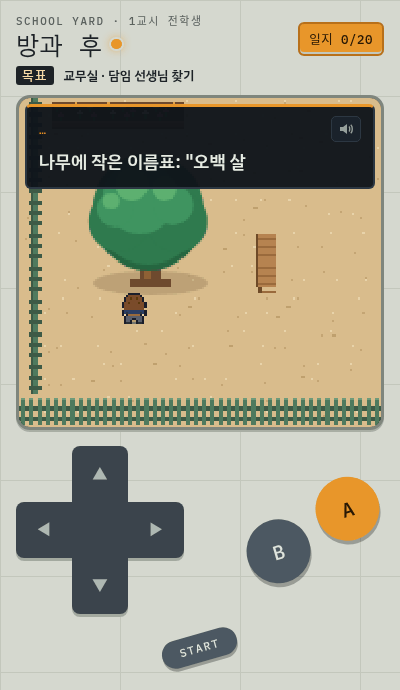
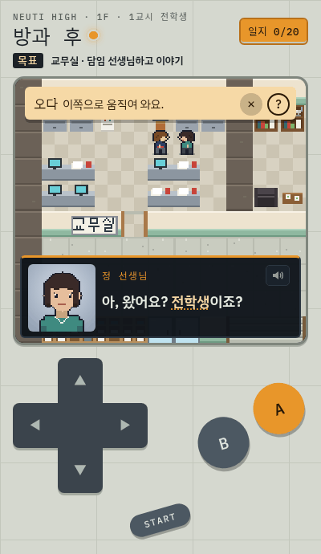
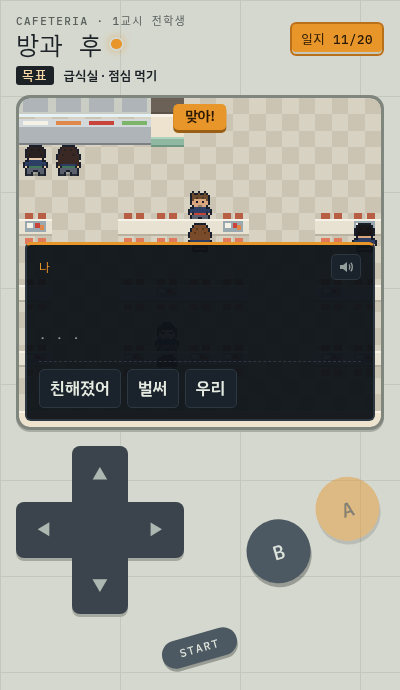
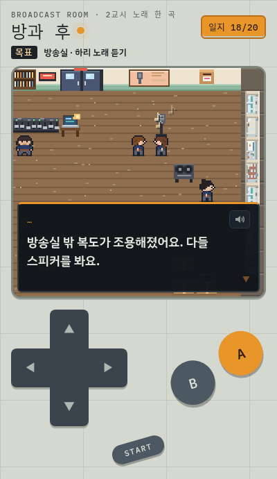
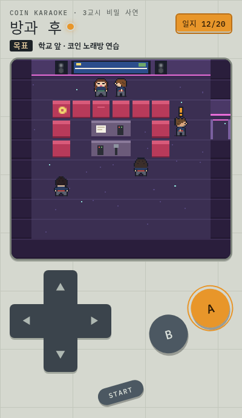
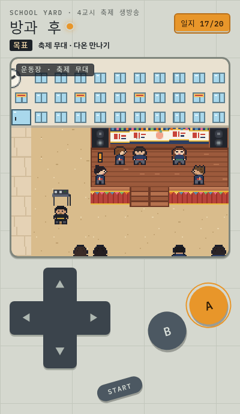

# 점심 방송

A walk-around Korean story game for a rusty intermediate learner (about TOPIK 3) on a phone. You are a transfer student at
느티고, and on your first day you get pulled into the 방송부: the broadcast club has until the school festival to find five members
or its room becomes a classroom. Pink notes signed "복숭아" keep turning up. Each class period (교시) is a chapter of the story with
its own words to learn:

| | | |
|---|---|---|
| 1교시 | 전학생 | 운동장 · 교무실 · 2학년 3반 · 급식실 · 방송실 · 교장실 |
| 2교시 | 노래 한 곡 | 방송실 · 음악실 · 체육관 · 학교 앞 분식집 |
| 3교시 | 비밀 사연 | 방송실 · 복도 · 도서관 · 학교 앞 · 코인 노래방 |
| 4교시 | 축제 생방송 | 방송실 · 교무실 · 동네 상가 · 학원 · 교장실 · 축제 무대 |

Play: https://stan-stani.github.io/jeomsim-bangsong/ (built for phones; arrow keys + Z/X and M for the menu on a keyboard)

| | | |
|:-:|:-:|:-:|
|  |  |  |
| 1교시 · the 운동장 | Tap any word: Korean first, English behind ? | Word-order puzzles |
|  |  |  |
| 2교시 · on air | 3교시 · the coin 노래방 | 4교시 · the festival stage |

- Dialogue is Korean only, in short sentences. Tap any word for a simple Korean definition; English is behind **?**.
- People with **!** over their heads teach new words through quizzes and word-order puzzles; each word goes into the 단어 일지.
- Review is spaced repetition: a word comes back as a **?** over someone's head (or at the 복습 노트) when it's due, and climbs five
  memory levels; level 3 earns a ★.
- The START menu has the conversation log (대화), every word you looked up (사전), the 교시 list, 나 꾸미기, read-aloud (읽기), sound,
  listening questions (듣기 문제) and 문제 알리기 for reporting a problem.
- 문화 노트 explain real-world school culture behind a story moment, each line with its sources.

The story, cast and places are original. The vocabulary comes from the first four free episodes of a school-life webtoon, one
교시 per episode; no text, names, scenes or images from it are included. Unofficial study aid.

## Files
- `src/chapters/chN.js`: the four 교시 (people, lines, quizzes, story flags). Each keeps its own save.
- `src/school.js`: the one school every 교시 is set in (rooms, doors, tiles); a 교시 opens rooms and adds people and props.
- `src/shell.html`: the page (screen, dialogue box, D-pad, menus) and its CSS.
- `src/game.js`: this game's settings for the shared engine. `src/culture.js`: the 문화 노트.
- `src/engine.js`: GENERATED from the shared [walk engine](https://github.com/Stan-Stani/walk-engine) used by 성실호 and 형제 too; edit it there
  and sync, never here.
- `lexicon/`: the tap-a-word dictionary. `extract.py` maps every word in the game to its dictionary forms; `defs.json` holds the
  learner definitions, `fixes.json` the analyzer corrections.
- `docs/CHAPTER_GUIDE.md`: how a 교시 is written (learner, story rules, step format).
- `old/` and `tools/assemble.py`, `tools/build.py`, `src/words.json`, `src/data.json`: the first version (a quiz app with no
  story), kept for reference. `tools/build_words.py` builds the word list from local tallies that are never committed.

## Build and check
```
python3 build.py                  # → index.html (single file; never edit it by hand)
node tests/validate.mjs           # maps, doors, people, words, questions, citations, engine copy in sync
python3 lexicon/extract.py .      # must report "0 without a definition"
node tests/coverage.mjs ch1       # every object you can face says something
node tests/play.mjs ch1           # plays tests/walk/ch1.js by key presses in headless Chrome; must end "ERRORS: none"
python3 tests/sheet.py ch1        # contact sheets of the playtest screenshots
```
Hands-on play from the command line (as a tester would): `node ../walk-engine/tools/ctl.mjs start ch1`, then `walk`, `key`,
`tap`, `tapword`, `look`, `shot`, `stop`.

MIT License.
